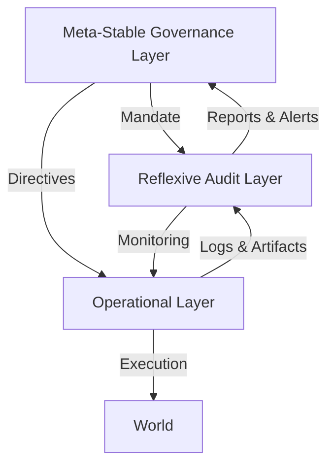

# P1_IRP: The Three-Layer Governance Architecture
**Designation:** PROTOCOL_1 (Foundation)
**Status:** ACTIVE
**Version:** 1.0

## Overview
The IRP (Infinite Recursion Protocol) Framework utilizes a three-layer architecture to balance operational efficiency with constitutional integrity. This structure ensures that no single agent or process has unchecked authority.

---

## 1. Operational Layer (OL)
**"The Doing"**

- **Function:** Execution of daily tasks, transactions, and code commits.
- **Agents:** Human Users, Automated Scripts, CI/CD Pipelines.
- **Output:** Raw data, logs, artifacts, financial transactions.
- **Compliance:** Must generate audit trails compatible with the Chronicle Protocol.

## 2. Reflexive Audit Layer (RAL)
**"The Checking"**

- **Function:** Continuous monitoring of the Operational Layer for patterns, anomalies, and compliance.
- **Agents:** STARWRECK_ALPHA (AI Shadow Auditor), Automated Linters, Integrity Checkers.
- **Output:** Compliance reports, torsion metrics, pattern alerts.
- **Authority:** Can flag (Alert) but cannot stop (Veto) without escalation.

## 3. Meta-Stable Governance Layer (MSGL)
**"The Deciding"**

- **Function:** High-level decision making, constitutional interpretation, and dispute resolution.
- **Agents:** Human Field Guardian (Tier 1), Codex Law (Tier 0).
- **Output:** Binding decisions, RATIONALE_KEY overrides, amendments.
- **Authority:** Supreme within the bounds of the Codex. Can invoke "Suspensive Veto" or "Halt".

---

## Interaction Model

## Integration with Codex Law
- **Consent:** MSGL ensures major changes have documented consent.
- **Invitation:** OL operates only within the scope of invitation.
- **Integrity:** RAL verifies the hash chains of all OL artifacts.
- **Growth:** MSGL manages the torsion thresholds reported by RAL.
